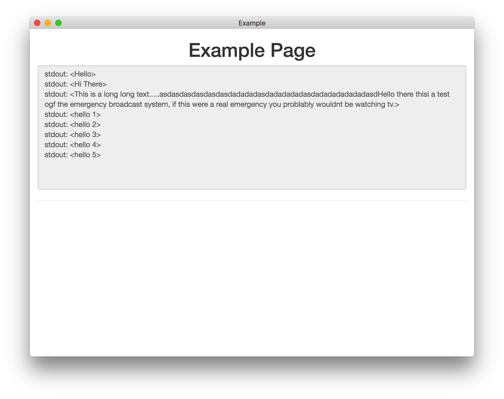

An HTML5 stand alone app using GitHub Electron (Chrome engine + Node.js) -- this is a GUI wrapper example that runs and process output of a bash shell command. 

# VERSION
- Electron: 1.6.10
- Node: 7.4.0
- Chromium: 56.0.2924.87
- V8: 5.6.326.50


# SETUP
1. Install npm and github's electron
2. run `npm install` on project path
3. to run the application
    1. run by `npm start` or `electron .` - this when you edited something your need to stop and run again to see the changed
    2.  run by `gulp` - this with auto reload the app

#### Install GitHub's Electron
```Shell
$ sudo npm install electron-prebuilt -g
```

#### Clone this repository
```Shell
$ mkdir ~/projects/
$ git clone https://github.com/kamontat/electron-bootstrap-shell-gulp.git example
$ cd example
```

#### Example Image

